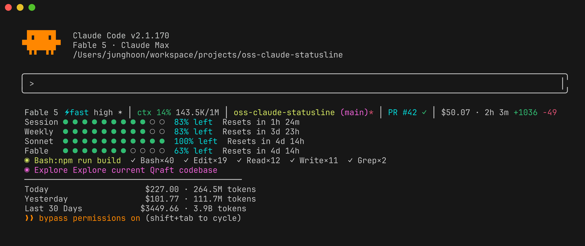

<div align="center">
  <h1>claude-statusline</h1>
  <p>Claude Code를 위한 풍부한 상태줄(statusline) — 순수 bash, Node.js 불필요.</p>
</div>

<p align="center">
  <a href="README.md">English</a> ·
  <strong>한국어</strong>
</p>

<p align="center">
  <a href="#설치"><strong>설치</strong></a> ·
  <a href="#무엇을-보여주나"><strong>기능</strong></a> ·
  <a href="#설정"><strong>설정</strong></a> ·
  <a href="#동작-원리"><strong>동작 원리</strong></a> ·
  <a href="#claude-hud-와의-비교"><strong>claude-hud 비교</strong></a>
</p>

<p align="center">
  <a href="https://github.com/JungHoonGhae/claude-statusline/stargazers"></a>
  <a href="LICENSE"></a>
  <a href="https://github.com/JungHoonGhae/claude-statusline"></a>
  <a href="https://github.com/JungHoonGhae/claude-statusline"></a>
</p>

<p align="center">
  
</p>

## 왜 필요한가

Claude Code 기본 상태줄은 모델 이름과 비용만 보여줍니다. 다음은 알 수 없습니다:

- 컴팩션(compaction)이 일어나기 전까지 컨텍스트를 얼마나 썼는지
- 사용량 한도(rate limit)에 얼마나 근접했는지
- 백그라운드에서 어떤 도구/에이전트가 돌고 있는지
- 오늘, 이번 주, 이번 달에 얼마를 썼는지

비용이 문제가 되지 않는 Max 플랜에서도, 토큰 사용량을 추적하면 자신의 사용 패턴을 이해하고 워크플로우를 최적화하는 데 도움이 됩니다.

이 상태줄이 그 모든 것을 해결합니다.

## 무엇을 보여주나

```
  Fable 5 high ✦ │ ctx 14% ● ○ ○ ○ ○ 143.5K/1M │ oss-qraft (main) │ PR #42 ✓ │ $50.07 · 2h 3m · ~$24/hr +1036 -49
  Session ● ● ● ● ● ● ● ● ○ ○  83% left  Resets in 1h 27m
  Weekly  ● ● ● ● ● ● ● ● ○ ○  83% left  Resets in 3d 23h
  Sonnet  ● ● ● ● ● ● ● ● ● ○  95% left  Resets in 4d 15h
  ✓ Bash×40  ✓ Edit×19  ✓ Read×12  ✓ Write×11  ✓ Grep×2
  ◐ Explore Explore current Qraft codebase
  ─────────────────────────────────────────────
  Today            $227.00 · 264.5M tokens
  Yesterday        $101.77 · 111.7M tokens
  Last 30 Days    $3449.66 · 3.9B tokens
```

| 영역 | 세부 내용 |
|---------|---------|
| **헤더** | 모델 + 배지(⚡ fast mode, effort 레벨, ✦ thinking, ◑ output style, ⛭ agent), 미니 막대와 토큰 수가 함께 표시되는 컨텍스트 %(143.5K/1M, 프리미엄 임계값 초과 시 ⚠200k+ 표시), 프로젝트, git 브랜치 + dirty + ↑ahead ↓behind, PR 번호 + 리뷰 상태(클릭 가능), 세션 비용 · 소요 시간 · ~$/hr 소모율, 추가/삭제 줄 수, 선택적 세션 이름 |
| **컴팩션 경고** | 컨텍스트가 임계값을 넘으면 빨간 경고 |
| **사용량 한도** | Session(5h) / Weekly(7d) / 모델별 버킷(Opus, Sonnet, Fable, … 자동 감지) / Extra usage — 게이지 막대 + 남은 % + 리셋 시간 |
| **도구 활동** | 실행 중인 도구, 완료된 도구 횟수, 활성 에이전트 |
| **토큰 비용** | Today / Yesterday / Last 30 days — 비용 및 토큰 수 |
| **예산 알림** | 일일 지출이 설정한 한도를 넘으면 빨간 경고 |

### 헤더 배지

| 배지 | 의미 |
|-------|---------|
| `⚡fast` | Fast mode 활성화 |
| `high` | 추론 effort 레벨 (low/medium/high/max) |
| `✦` | Extended thinking 활성화 |
| `◑explanatory` | 활성 output style (`default`가 아닐 때만) |
| `⛭security-reviewer` | 활성 에이전트 (`--agent` 세션 중) |
| `⚠200k+` | 200k 프리미엄 장문맥 과금 임계값 초과 (200k 초과 컨텍스트 모델 한정) |
| `PR #42 ✓` | 열린 PR — ✓ 승인됨 · ● 대기 중 · ✗ 변경 요청됨 · ◌ 초안 |
| `+1036 -49` | 이번 세션에서 추가/삭제된 줄 수 |

배지는 해당 데이터가 있을 때만 나타납니다 — 예를 들어 `⚡fast`는 fast mode가 켜져 있을 때만, `PR #42`는 PR이 열려 있는 동안에만 표시됩니다.

### 모델별 사용량 한도 버킷

모델별 주간 버킷은 OAuth usage API로부터 **자동 감지**됩니다 — 당신의 플랜에 대해 Anthropic이 보고하는 버킷이 무엇이든 자동으로 표시되므로, 새 모델이 추가되어도 스크립트를 수정할 필요가 없습니다. 버킷은 모델 성능 순서(성능이 높은 순, `Fable` > `Opus` > `Sonnet` > `Haiku`)로 정렬되며, API가 `null`로 보고하는 버킷(당신의 플랜에서 비활성)은 숨겨집니다. 계정에 extra usage 크레딧이 활성화되어 있으면 `Extra` 게이지가 나타납니다.

> 참고: 어떤 버킷이 존재하는지는 당신의 플랜과 사용량에 따라 다릅니다. 버킷은 해당 모델의 사용량이 추적된 후에만 나타납니다 — 대부분의 계정은 하나만(예: 위처럼 `Sonnet`) 보게 되며, `Opus`는 Opus를 사용한 후에 나타납니다. 둘 이상이 활성화되면 성능 순으로 정렬되고, Anthropic이 추가하는 새 모델은 자동으로 나타납니다 — 업데이트가 필요 없습니다.

### 색상 규칙

| | 초록 | 노랑 | 빨강 |
|---|---|---|---|
| **컨텍스트** | < 30% | 30–70% | > 70% |
| **사용량 한도** | 남은 양 > 50% | 20–50% 남음 | < 20% 남음 |

## 설치

### 플러그인 (권장)

```bash
/plugin marketplace add JungHoonGhae/claude-statusline
/plugin install claude-statusline@claude-statusline
```

세션이 시작될 때마다 자동 설정 — 스크립트가 플러그인과 함께 최신 상태로 유지됩니다.

### 셸

```bash
curl -fsSL https://raw.githubusercontent.com/JungHoonGhae/claude-statusline/main/install-remote.sh | bash
```

<details>
<summary><strong>다른 설치 방법</strong></summary>

#### 클론 후 설치

```bash
git clone https://github.com/JungHoonGhae/claude-statusline.git
cd claude-statusline
bash install.sh
```

#### 수동 설치

```bash
cp statusline.sh ~/.claude/statusline-command.sh
cp ccusage-cache.sh ~/.claude/ccusage-cache.sh
chmod +x ~/.claude/statusline-command.sh ~/.claude/ccusage-cache.sh
cp statusline.conf.example ~/.claude/statusline.conf
```

`~/.claude/settings.json`에 추가:

```json
{
  "statusLine": {
    "type": "command",
    "command": "bash ~/.claude/statusline-command.sh"
  }
}
```

</details>

### 사전 요구사항

- **jq**와 **curl** — 설치 스크립트가 패키지 매니저(brew / apt / dnf / yum / pacman / apk)로 자동 설치합니다
- **Node.js** (선택) — 토큰 비용 영역은 `npx ccusage@latest`를 실행합니다. 전역 설치는 필요 없습니다

나중에 의존성이 사라지더라도(예: 컨테이너 재시작 후), 상태줄은 영역을 조용히 숨기는 대신 설치 안내를 표시합니다.

## 설정

`~/.claude/statusline.conf`를 편집해 커스터마이즈:

```bash
# 영역 토글
SHOW_RATE_LIMITS=true
SHOW_TOOLS=true
SHOW_AGENTS=true
SHOW_CCUSAGE=true

# 헤더 부가 정보
SHOW_CONTEXT_BAR=true
SHOW_BURN_RATE=true
SHOW_GIT_AHEAD=true
SHOW_LINKS=true
SHOW_SESSION_NAME=false

# 컨텍스트 임계값
CONTEXT_WARN_PCT=30       # 노란 경고
CONTEXT_CRIT_PCT=70       # 빨강 + 컴팩션 경고

# 예산 알림 (0 = 비활성)
DAILY_BUDGET=0
```

| 옵션 | 기본값 | 설명 |
|--------|---------|-------------|
| `SHOW_RATE_LIMITS` | `true` | Session/weekly/모델별 사용량 한도 막대 |
| `SHOW_TOOLS` | `true` | 트랜스크립트 기반 도구 활동 |
| `SHOW_AGENTS` | `true` | 트랜스크립트 기반 에이전트 활동 |
| `SHOW_CCUSAGE` | `true` | 일간/월간 토큰 비용 통계 |
| `SHOW_CONTEXT_BAR` | `true` | ctx % 옆 5점 미니 게이지 |
| `SHOW_BURN_RATE` | `true` | 헤더의 ~$/hr 소모율 |
| `SHOW_GIT_AHEAD` | `true` | upstream 대비 ↑ahead ↓behind |
| `SHOW_LINKS` | `true` | 클릭 가능한 PR 링크 (OSC 8; tmux에서 자동 비활성) |
| `SHOW_SESSION_NAME` | `false` | 헤더에 `/rename` 세션 이름 표시 |
| `CONTEXT_WARN_PCT` | `30` | 노랑이 되는 컨텍스트 % 임계값 |
| `CONTEXT_CRIT_PCT` | `70` | 빨강 + 컴팩션 경고가 되는 컨텍스트 % 임계값 |
| `DAILY_BUDGET` | `0` | 일일 예산 알림(USD, 0 = 비활성) |

모든 옵션은 conf 파일 **또는** 환경 변수로 설정할 수 있습니다(conf 파일이 우선합니다). 상태줄은 또한 `$COLUMNS`를 사용해 좁은 터미널에서 레이아웃을 자동으로 압축합니다.

전체 주석이 달린 템플릿은 [statusline.conf.example](./statusline.conf.example)을 참고하세요.

## claude-hud 와의 비교

| | claude-statusline | [claude-hud](https://github.com/jarrodwatts/claude-hud) |
|---|---|---|
| **유형** | 순수 bash 스크립트 | Node.js/TypeScript 플러그인 |
| **설치** | 플러그인 마켓플레이스, `curl` 원라이너, 또는 파일 2개 복사 | 플러그인 마켓플레이스 |
| **의존성** | `jq`만 | Node.js 18+ |
| **사용량 한도** | stdin + OAuth API (모델별 + extra usage) | stdin만 |
| **토큰 비용** | ccusage로 일간/월간 | — |
| **예산 알림** | 설정 가능한 일일 한도 | — |
| **컴팩션 경고** | 컨텍스트 임계값 알림 | — |
| **설정** | 단순 KEY=value conf 파일 | JSON 설정 + `/configure` 명령 |
| **플랫폼** | macOS, Linux, Windows (Git Bash/WSL) | 크로스 플랫폼 |

## 동작 원리

```
Claude Code stdin (JSON)
  ├── model, effort, thinking, fast_mode, context_window, cost, pr, transcript_path
  └── rate_limits (v2.1.6+)     ← stdin의 Session/Weekly
          │
statusline.sh
  ├── stdin rate_limits            주 데이터 소스
  ├── OAuth API (2분 캐시)         폴백 + 모델별 버킷(자동 감지) + extra usage
  ├── git CLI                      브랜치 & dirty 상태 (stdin은 더 이상 .git을 담지 않음)
  ├── Transcript JSONL 파싱        도구 & 에이전트 활동
  └── ccusage-cache.sh (백그라운드, 10분)  토큰 비용 집계
          │
stdout → Claude Code 표시
```

| 데이터 | 소스 | 캐시 |
|------|--------|-------|
| 컨텍스트 / 모델 / effort / PR / 비용 | stdin (네이티브) | — |
| Session & Weekly 한도 | stdin `rate_limits` | — |
| 모델별 한도(Opus/Sonnet/Fable/…), extra usage | OAuth API | 2분 |
| Git 브랜치 & dirty 상태 | `git` CLI (stdin 폴백) | — |
| 도구 & 에이전트 활동 | Transcript JSONL | — |
| 토큰 비용 | ccusage | 10분 (백그라운드) |

## 문제 해결

### Docker/devcontainer 재시작 후 상태줄이 비어 보임

컨테이너 재시작은 컨테이너 파일시스템을 이미지 상태로 되돌립니다 — 마운트된 볼륨(예: `~/.claude`)만 살아남습니다. `jq`를 실행 중인 컨테이너 안에 설치했다면 사라지고, 상태줄 렌더링이 멈춥니다. 의존성을 이미지에 미리 포함시키세요:

```dockerfile
# Debian/Ubuntu
RUN apt-get update && apt-get install -y jq curl git
# Alpine
RUN apk add --no-cache jq curl git bash
```

ccusage 토큰 비용 영역을 사용한다면 이미지에 Node.js도 필요합니다.

v1.2.2부터는 상태줄이 조용히 비어 버리는 대신 `claude-statusline: jq not found`를 표시합니다.

### ccusage 영역이 보이지 않음

Today/Yesterday/Last 30 Days 영역은 `npx`(Node.js)가 필요합니다. 실행할 수 없을 때 상태줄은 이유와 함께 흐릿한 `✗ ccusage: ...` 힌트를 표시합니다. 캐시는 백그라운드에서 갱신되므로, 설치 후 영역이 나타나기까지 약 10초의 갱신 주기 한 번이 걸릴 수 있습니다.

## 플랫폼 지원

**macOS**, **Linux**, **Windows** (Git Bash / WSL)에서 동작합니다.

- **macOS**: Keychain에서 OAuth 토큰 (`security` 명령)
- **Linux**: `~/.claude/.credentials.json` 또는 GNOME Keyring(`secret-tool`)에서 OAuth 토큰
- **Windows**: `~/.claude/.credentials.json` 또는 `%APPDATA%/Claude/credentials.json`에서 OAuth 토큰

## 변경 이력

전체 버전 이력은 [CHANGELOG.md](CHANGELOG.md)를 참고하세요. 최근 주요 사항:

- **1.5.0** — 프리미엄 장문맥 `⚠200k+` 마커, output style · agent 배지, 한국어 README
- **1.4.1** — 반응형 3단계 레이아웃(`$COLUMNS` 인식), 미사용 버킷에 `idle` 레이블, 정확한 스크린샷
- **1.4.0** — 헤더 부가 정보: 컨텍스트 막대, ~$/hr 소모율, git ↑ahead ↓behind, 클릭 가능한 PR 링크
- **1.3.0** — 의존성 자동 설치, 모든 조용한 실패를 표면화, 성능 순 모델 버킷
- **1.2.x** — 자동 감지 모델별 사용량 버킷, ccusage v18 호환성
- **1.1.0** — v2.1.x stdin 지원: 모델 배지, 컨텍스트 토큰, PR 배지, 추가/삭제 줄 수

## 기여하기

기여를 환영합니다! 변경을 테스트하는 방법과 프로젝트 가이드라인은 [CONTRIBUTING.md](CONTRIBUTING.md)를 참고하세요. 참여하면 [행동 강령](CODE_OF_CONDUCT.md)에 동의하는 것으로 간주합니다. 보안 이슈를 신고하려면 [보안 정책](SECURITY.md)을 확인하세요.

## 크레딧

[jarrodwatts/claude-hud](https://github.com/jarrodwatts/claude-hud)에서 영감을 받았습니다.
토큰 비용 추적은 [ryoppippi/ccusage](https://github.com/ryoppippi/ccusage)로 구동됩니다.

## 후원

이 프로젝트가 당신의 워크플로우에 도움이 되었다면, 커피 한 잔 사주는 것을 고려해 주세요.

<a href="https://www.buymeacoffee.com/lucas.ghae">
  
</a>

## 라이선스

MIT

<p align="center">
  <a href="https://www.star-history.com/?repos=JungHoonGhae%2Fclaude-statusline&type=date&legend=top-left">
    <picture>
      <source media="(prefers-color-scheme: dark)" srcset="https://api.star-history.com/image?repos=JungHoonGhae/claude-statusline&type=date&theme=dark&legend=top-left" />
      <source media="(prefers-color-scheme: light)" srcset="https://api.star-history.com/image?repos=JungHoonGhae/claude-statusline&type=date&legend=top-left" />
      
    </picture>
  </a>
</p>
