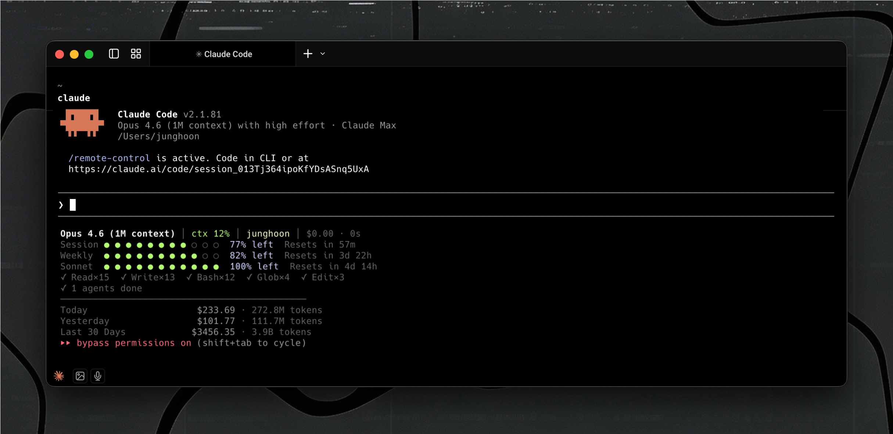

<div align="center">
  <h1>claude-statusline</h1>
  <p>A rich statusline for Claude Code — pure bash, no Node.js required.</p>
</div>

<p align="center">
  <a href="#installation"><strong>Install</strong></a> ·
  <a href="#what-it-shows"><strong>Features</strong></a> ·
  <a href="#configuration"><strong>Config</strong></a> ·
  <a href="#how-it-works"><strong>How it works</strong></a> ·
  <a href="#vs-claude-hud"><strong>vs claude-hud</strong></a>
</p>

<p align="center">
  <a href="https://github.com/JungHoonGhae/claude-statusline/stargazers"></a>
  <a href="LICENSE"></a>
  <a href="https://github.com/JungHoonGhae/claude-statusline"></a>
  <a href="https://github.com/JungHoonGhae/claude-statusline"></a>
</p>

<p align="center">
  
</p>

## Why?

The default Claude Code statusline only shows the model name and cost. You don't know:

- How much context you've used until compaction hits
- How close you are to rate limits
- What tools/agents are running in the background
- How much you've spent today, this week, or this month

Even on Max plan where cost isn't a concern, tracking your token usage helps you understand your usage patterns and optimize your workflow.

This statusline fixes all of that.

## What it shows

```
  Opus 4.6 (1M context) │ ctx 44% │ oss-qraft (main) │ $50.07 · 2h 3m
  Session ● ● ● ● ● ● ● ● ○ ○  83% left  Resets in 1h 27m
  Weekly  ● ● ● ● ● ● ● ● ○ ○  83% left  Resets in 3d 23h
  Sonnet  ● ● ● ● ● ● ● ● ● ●  100% left  Resets in 4d 15h
  ✓ Bash×40  ✓ Edit×19  ✓ Read×12  ✓ Write×11  ✓ Grep×2
  ◐ Explore Explore current Qraft codebase
  ─────────────────────────────────────────────
  Today            $227.00 · 264.5M tokens
  Yesterday        $101.77 · 111.7M tokens
  Last 30 Days    $3449.66 · 3.9B tokens
```

| Section | Details |
|---------|---------|
| **Header** | Model, context % (color-coded), project, git branch, session cost & duration |
| **Compaction Warning** | Red warning when context exceeds critical threshold |
| **Rate Limits** | Session (5h) / Weekly (7d) / Opus / Sonnet — gauge bar + % left + reset time |
| **Tool Activity** | Running tools, completed tool counts, active agents |
| **Token Costs** | Today / Yesterday / Last 30 days — cost & token count |
| **Budget Alert** | Red warning when daily spending exceeds configured limit |

### Color coding

| | Green | Yellow | Red |
|---|---|---|---|
| **Context** | < 30% | 30–70% | > 70% |
| **Rate limit** | > 50% left | 20–50% left | < 20% left |

## Installation

### Plugin install (recommended)

```bash
/plugin marketplace add JungHoonGhae/claude-statusline
/plugin install claude-statusline@claude-statusline
```

Auto-setup on every session start — no manual config needed.

### One-liner install

```bash
curl -fsSL https://raw.githubusercontent.com/JungHoonGhae/claude-statusline/main/install-remote.sh | bash
```

### Clone & install

```bash
git clone https://github.com/JungHoonGhae/claude-statusline.git
cd claude-statusline
bash install.sh
```

<details>
<summary><strong>Manual install</strong></summary>

```bash
# 1. Copy scripts
cp statusline.sh ~/.claude/statusline-command.sh
cp ccusage-cache.sh ~/.claude/ccusage-cache.sh
chmod +x ~/.claude/statusline-command.sh ~/.claude/ccusage-cache.sh

# 2. Copy default config
cp statusline.conf.example ~/.claude/statusline.conf
```

Add to `~/.claude/settings.json`:

```json
{
  "statusLine": {
    "type": "command",
    "command": "bash ~/.claude/statusline-command.sh"
  }
}
```

Restart Claude Code.

</details>

### Prerequisites

- **jq** — `brew install jq` (macOS) / `sudo apt install jq` (Linux)
- **curl** — pre-installed on most systems
- **ccusage** (optional) — `npm install -g ccusage` for token cost tracking

## Configuration

Edit `~/.claude/statusline.conf` to customize:

```bash
# Toggle sections
SHOW_RATE_LIMITS=true
SHOW_TOOLS=true
SHOW_AGENTS=true
SHOW_CCUSAGE=true

# Context thresholds
CONTEXT_WARN_PCT=30       # Yellow warning
CONTEXT_CRIT_PCT=70       # Red + compaction warning

# Budget alert (0 = disabled)
DAILY_BUDGET=0
```

| Option | Default | Description |
|--------|---------|-------------|
| `SHOW_RATE_LIMITS` | `true` | Show session/weekly/model rate limit bars |
| `SHOW_TOOLS` | `true` | Show tool activity from transcript |
| `SHOW_AGENTS` | `true` | Show agent activity from transcript |
| `SHOW_CCUSAGE` | `true` | Show daily/monthly token cost stats |
| `CONTEXT_WARN_PCT` | `30` | Context % threshold for yellow |
| `CONTEXT_CRIT_PCT` | `70` | Context % threshold for red + compaction warning |
| `DAILY_BUDGET` | `0` | Daily budget alert in USD (0 = disabled) |

See [statusline.conf.example](./statusline.conf.example) for a fully commented template.

## vs claude-hud

| | claude-statusline | [claude-hud](https://github.com/jarrodwatts/claude-hud) |
|---|---|---|
| **Type** | Pure bash scripts | Node.js/TypeScript plugin |
| **Install** | Plugin marketplace, one-liner `curl`, or copy 2 files | Plugin marketplace |
| **Dependencies** | `jq` only | Node.js 18+ |
| **Rate limits** | stdin + OAuth API (model-specific Opus/Sonnet) | stdin only |
| **Token costs** | Daily/monthly via ccusage | — |
| **Budget alert** | Configurable daily limit | — |
| **Compaction warning** | Context threshold alert | — |
| **Configuration** | Simple KEY=value conf file | JSON config + `/configure` command |
| **Platform** | macOS, Linux, Windows (Git Bash/WSL) | Cross-platform |

## How it works

```
Claude Code stdin (JSON)
  ├── model, context, cost, git, transcript_path
  └── rate_limits (v2.1.6+)     ← Session/Weekly from stdin
          │
statusline.sh
  ├── stdin rate_limits            Primary source
  ├── OAuth API (cached 2m)        Fallback + model-specific limits (Opus/Sonnet)
  ├── Transcript JSONL parsing     Tool & agent activity
  └── ccusage-cache.sh (bg, 10m)  Token cost aggregation
          │
stdout → Claude Code displays
```

| Data | Source | Cache |
|------|--------|-------|
| Context / model / cost | stdin (native) | — |
| Session & Weekly limits | stdin `rate_limits` | — |
| Opus & Sonnet limits | OAuth API | 2 min |
| Tool & agent activity | Transcript JSONL | — |
| Token costs | ccusage | 10 min (background) |

## Platform support

Works on **macOS**, **Linux**, and **Windows** (Git Bash / WSL).

- **macOS**: OAuth token from Keychain (`security` command)
- **Linux**: OAuth token from `~/.claude/.credentials.json` or GNOME Keyring (`secret-tool`)
- **Windows**: OAuth token from `~/.claude/.credentials.json` or `%APPDATA%/Claude/credentials.json`

## Credits

Inspired by [jarrodwatts/claude-hud](https://github.com/jarrodwatts/claude-hud).
Token cost tracking powered by [syakoo/ccusage](https://github.com/syakoo/ccusage).

## Support

If this helped your workflow, consider buying me a coffee.

<a href="https://www.buymeacoffee.com/lucas.ghae">
  
</a>

## License

MIT

<p align="center">
  <a href="https://www.star-history.com/?repos=JungHoonGhae%2Fclaude-statusline&type=date&legend=top-left">
    <picture>
      <source media="(prefers-color-scheme: dark)" srcset="https://api.star-history.com/image?repos=JungHoonGhae/claude-statusline&type=date&theme=dark&legend=top-left" />
      <source media="(prefers-color-scheme: light)" srcset="https://api.star-history.com/image?repos=JungHoonGhae/claude-statusline&type=date&legend=top-left" />
      
    </picture>
  </a>
</p>
